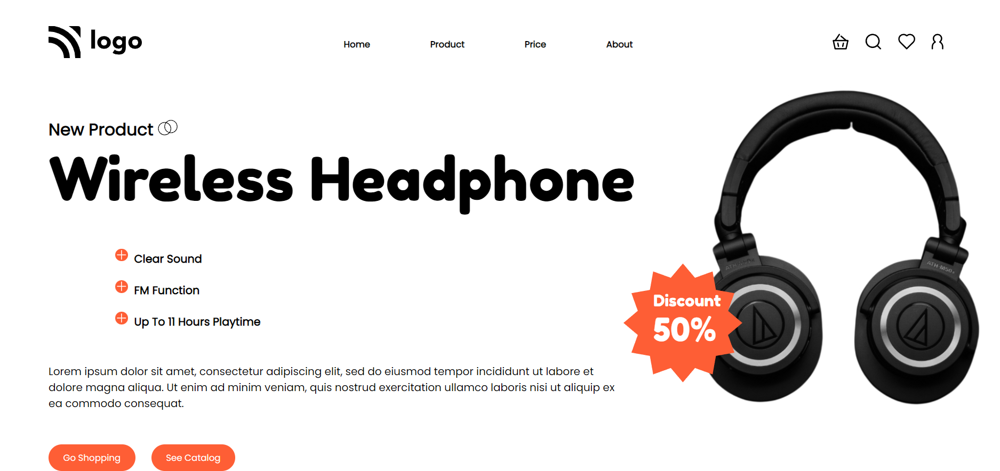

# HTML Project 7

> This is my seventh project of HTML and CSS and It is a static page but I learned alot.

 #

## Project Web page

In this project, I learned about the transform property in CSS and its rotate function which rotate your content to a specific degree.

[Visit this website](https://abhi-project-7.netlify.app/)

#

To see my work visit my [Portfolio](https://portfolio-of-abhishek.netlify.app)

